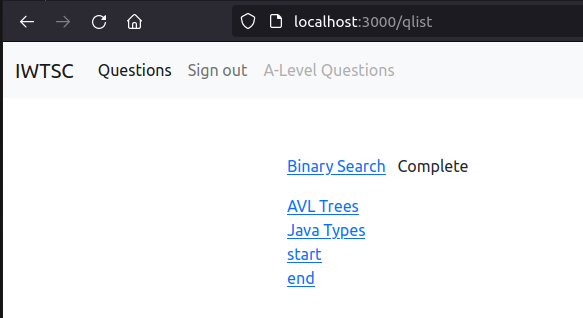

# 22018990 / Web programming, Advanced - 2022/23 assignment


## Part 1


How to create the containers

### awp_frontend

```
docker build --no-cache -t awp_frontend .
docker run -ti -d --name awp_frontend1 -p 3000:3000 awp_frontend
```

### awp_backend

```
docker build -t awp_backend .
docker build --no-cache -t awp_backend .
docker run -ti -d --name awp_backend1 --net awp-net -p 8080:8080 awp_backend
```

### awp_mongo

```
docker build --no-cache -t awp_mongo .
docker run -ti -d --name awp_mongo1 --net awp-net -p 5000:5000 awp_mongo
```

### aqc

```
docker build --no-cache -t aqc .
docker run -ti -d --name aqc1 --net awp-net -p 4000:4000 -p 4040:4040 aqc
```

Create a user-defined bridge network
```
docker network create awp-net
```


## Part 2

I have been able to implement point 1 and 2 of Part 1.
Which means split frontend, banckend and mongo into different microservices.
However, for part 3 I have not been able to achieve the scope.
My orgininal idea was to call the aqc service directly from the backend microservice.
In this way I could be able to enrich the JSON responses after query the mongodb microservices.
The implemented code is visible below :(activity.controller.js)


```
.then(qs => {
  if (qs && qs.length > 0) {
    var qNames = qs.map((q) => {
      return {
        qid: q.dataValues.urltitle,
        title: q.dataValues.fulltitle
      }
    })

    var response_obj = {success: true, questions: qNames}
    qNames.push({qid: 'start', title: 'start'});
    /* retrieve questions from aqc */
    axios.get('http://aqc1:4040/api/aquestions/list')
      .then(function (response) {
        qNames.push({qid: 'then', title: 'then'});
        for (let i = 0; i < response.data.questions.length; i++) {
          qNames.push(response.data.questions[i]);
        }
        response_obj.response_data = response;
      })
      .catch(err => {
        /* silent the error */
        qNames.push({qid: 'error', title: 'error'});
      })
      .finally(function () {
        qNames.push({qid: 'finally', title: 'finally'});
        // always executed
      });
    qNames.push({qid: 'end', title: 'end'});

    return res.status(200).send(response_obj);
  } else {
    return res.status(404).send({success: false, questions: []});
  }
})

```

Just before retrieving questions from aqc I added a "placeholder" question "start" in order to understand at what point the code is executed.
A similar question has been placed at the end with title "end"
By looking the code is visible that a similar approach has been adopted for the axios call, catch and finally.
However as visible on the screenshot below, I can see start, end but none of the axios messages.




The insert_data.sh provided on the documentation, is using a deprecated `db.collection.insert()` method.
See https://www.mongodb.com/docs/mongodb-shell/reference/compatibility/#std-label-compatibility .
Found also while testing the Mongodb container

```
...       {"text": "All of the above", "correct": false}
...     ]
...   }
... ])
DeprecationWarning: Collection.insert() is deprecated. Use insertOne, insertMany, or bulkWrite.
{
  acknowledged: true,
  insertedIds: {
    '0': ObjectId("643bffc37f72c29d88ded329"),
    '1': ObjectId("643bffc37f72c29d88ded32a"),
    '2': ObjectId("643bffc37f72c29d88ded32b")
  }
}
```


```
MongooseError: Model.find() no longer accepts a callback
    at Function.find (...mongo/src/node_modules/mongoose/lib/model.js:2041:11)
    at ...mongo/src/server.js:33:11
    at Layer.handle [as handle_request] (...mongo/src/node_modules/express/lib/router/layer.js:95:5)
    at next (...mongo/src/node_modules/express/lib/router/route.js:144:13)
    at Route.dispatch (...mongo/src/node_modules/express/lib/router/route.js:114:3)
    at Layer.handle [as handle_request] (...mongo/src/node_modules/express/lib/router/layer.js:95:5)
```


```
MongooseError: Operation `answers_schemas.findOne()` buffering timed out after 10000ms
    at Timeout.<anonymous> (/home/andrea/uhi/course/UI111014_awp/assignment/assignment/awp_assignment/mongo/src/node_modules/mongoose/lib/drivers/node-mongodb-native/collection.js:185:23)
    at listOnTimeout (node:internal/timers:573:17)
    at process.processTimers (node:internal/timers:514:7)
/home/andrea/uhi/course/UI111014_awp/assignment/assignment/awp_assignment/mongo/src/node_modules/mongoose/lib/connection.js:755
    err = new ServerSelectionError();
          ^

```


## References

https://www.tutorialworks.com/container-networking/
